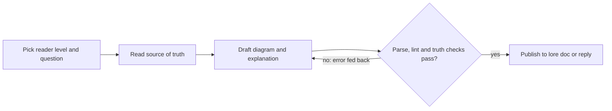

# diagram-skills

Claude Code skills that explain **and** diagram architectures, processes,
decisions, plans and data. Every diagram is Mermaid in Markdown, pitched to
the reader's level, drawn from the real repository, Quest tracker and lore
docs, and checked before it ships: it parses under the Mermaid version
GitHub renders, it follows an accessible profile, and every box traces to a
real source.

## Why

Models write diagram syntax well enough; a parse-and-repair loop fixes most
of the rest. What they get wrong is **truth**. In a 2026 study, node accuracy
was about 0.5–0.67 against edge accuracy of about 0.09–0.18, and models drew
the architecture they expected instead of the one in front of them. No
prior-art diagramming skill checked a diagram against its source or against
its own prose
([research](docs/reference/state-of-the-art-in-diagramming-for-agent-written-docs.md)).

This suite reads before it draws, cites every node, and checks the picture
against the records. It also never ships a diagram without a plain-English
explanation for the reader it was drawn for.

## The skills

| Skill | Answers | Draws from |
|---|---|---|
| `diagram-architecture` | What is this system, and what are its parts? | Repository tree, manifests, compose files, lore docs |
| `diagram-process` | What happens, in what order, and who does it? | Code, runbooks, specs |
| `diagram-decision` | What did we decide, against which options? | ADRs, Quest decisions |
| `diagram-plan` | What blocks what, and where are we? | Quest tasks and milestones (generated) |
| `diagram-data` | What is the shape of the data? | Migrations, DDL, ORM models (generated from DDL) |
| `diagram-review` | Is this diagram valid, legible and true? | The engine; also owns the shared rules |

## How a diagram is made

What does every skill do between a request and a published diagram?



Every skill follows this loop. The question comes first, so each diagram
answers one thing. Reading comes before drawing, so boxes come from records
rather than memory. The three checks loop back with the exact error until
they pass, and the diagram is published only with its explanation.

## Reader levels

The levels follow the plain-english-styles output styles. A skill uses the
level the user names, else the active `plain-english-*` style, else
intermediate.

| | Beginner | Intermediate | Advanced |
|---|---|---|---|
| Node cap | 7 | 12 | 20, then split |
| Labels | Plain words, no ids or jargon | Real names, glossed once | Ids and precise terms |
| Explanation | Conclusion, then one line per unclear box | What it shows and how we know | Claim, mechanism, action |

## The engine

It lives in `skills/diagram-review/scripts/`. The other skills reach it
through `${CLAUDE_SKILL_DIR}/../diagram-review/scripts`.

| Script | Does |
|---|---|
| `mermaid-check.mjs` | Parses every Mermaid fence with `mermaid.parse()` under jsdom, pinned to GitHub's Mermaid (11.17.2). No browser; about 40 ms per diagram |
| `diagram_lint.py` | The profile, `accTitle`/`accDescr`, node caps, a legend wherever colour is used, an explanation next to the fence |
| `diagram_truth.py` | Resolves each node's `%% ref` (path, schema, quest, lore, ext). Generated plans must match Quest's dependencies exactly |
| `quest_graph.py`, `schema_er.py`, `repo_inventory.py` | Generate plan and ER diagrams from records; list a repository's real parts |
| `diagram_export.py` | Opt-in SVG/PNG export through `mmdc`, about 650 MB, installed only on request |

`lore check` never looks inside a Mermaid fence. CI therefore runs these
checks on every pull request, plus a self-test that proves the parser
still fails broken diagrams.

## Install

diagram-skills is not yet listed in the
[opum-marketplace](https://github.com/opum-ai/opum-marketplace). Until it is,
load it from a checkout:

```bash
git clone https://github.com/opum-ai/diagram-skills
npm ci --prefix diagram-skills/skills/diagram-review/scripts   # the parse check, about 180 MB, no browser
claude --plugin-dir ./diagram-skills
```

The engine needs Node 20+ and Python 3.9+. Plan diagrams need the
[Quest](https://github.com/opum-ai/quest-cli) CLI; persisting to docs uses
[lore](https://github.com/opum-ai/lore-cli).

## Usage

The skills trigger on ordinary requests:

> I'm new to this repo. Give me an overview of how it fits together, with a diagram for our docs.

> What states can an order go through? Include what happens when payment fails.

> Make a diagram for ADR 0003 showing the options and which one we picked, for the steering group.

> What's still blocking the launch? Show me the dependencies.

> Our CFO isn't technical. Explain what data we keep about customers, with a simple picture.

> Review the diagram in docs/architecture.md before I merge it.

## Evaluation

Iteration 1 used 12 cases, two per skill, each run once with the skill and
once without (claude-opus-5-5). A grader re-derived the truth from the
fixture's real code, schema and Quest records
([benchmark](evals/benchmarks/iteration-1/benchmark.md),
[notes](docs/stories/evaluation-suite.md)).

| | With skill | Without skill |
|---|---|---|
| Expectations passed | 77 of 77 (100%) | 60 of 77 (78%) |
| Tokens per run | about 39k | about 28k |
| Time per run | about 78 s | about 62 s |

12 of the baseline's 17 failures were missing accessibility fields. The
others were plan views that showed finished or out-of-scope tasks, and
decision diagrams that did not mark or did not draw the options. On this
small fixture the baseline invented no components either, so the truth
checks did not yet separate the two. See Known limitations.

## Repository layout

```text
.claude-plugin/plugin.json    plugin manifest
.claude/skills/               symlinks to skills/ for local development
.github/workflows/ci.yml      parse, self-test, lint, pytest, lore check, truth
skills/<name>/                SKILL.md, examples/; diagram-review also has references/ and scripts/
evals/                        evals.json, fixtures/, setup_ws.sh, grade.py, benchmarks/
tests/                        pytest for the engine; gate and export self-tests; parser fixtures
docs/                         lore bundle: research, conventions, ADRs, spec, epic, stories
.quest/, .lore/               tracker and lore state
```

## Development

```bash
npm ci --prefix skills/diagram-review/scripts
node skills/diagram-review/scripts/mermaid-check.mjs docs skills README.md
python3 skills/diagram-review/scripts/diagram_lint.py docs skills README.md
python3 skills/diagram-review/scripts/diagram_truth.py --root . docs skills README.md
tests/mermaid_selftest.sh
python3 -m pytest -q
lore check
quest board
```

Evals: build workspaces with `evals/setup_ws.sh <dir>`, run each case with
and without the skill, then `python3 evals/grade.py <run-dir> --eval <id>`.

## Known limitations

- **Truth stops at nodes.** `%% ref` proves each box exists. Edges are
  checked exactly only for generated plan diagrams, and the prose is not
  machine-checked: one with-skill eval answer named the wrong migration
  file for a dropped table.
- **The evals are thin.** One run per arm, one small fixture, and truth
  assertions that did not discriminate. Harder fixtures are needed:
  larger repositories, and stale docs that name removed services.
- **Mermaid's C4 is experimental**, so architecture views are flowcharts
  with C4 classes. Mermaid's layout degrades past about 15 nodes.
- **The Mermaid pin is manual.** When GitHub upgrades, bump
  `skills/diagram-review/scripts/package.json` deliberately.
- **Terminals show source.** The Claude Code terminal prints Mermaid as
  text. GitHub, VS Code and JetBrains render it.
- **Known gaps queued for iteration 2:**
  - `repo_inventory.py` misses services called by raw URL.
  - `lore query` in a repository without a lore bundle leaves a cache
    directory behind.
  - Beginner ER views still need hand-written plain labels.

## License

MIT. See [LICENSE](LICENSE).
