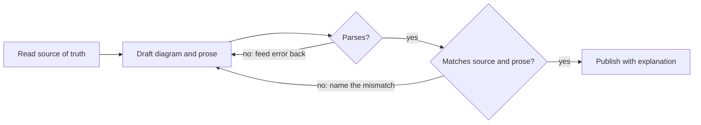

# State of the art in diagramming for agent-written docs

Research date: 2026-10-05 (task DSKI-1). Numbers in brackets point to the
Sources list at the end. "(secondary)" marks a claim resting on a
non-primary source. "(inference)" marks a conclusion no source states
directly. "Tested" means it was run on this machine (macOS arm64, Node
24.20.0, Graphviz 16.1.0); the lab files are described in
[Local evidence](#local-evidence).

## Summary

- **Syntax is the solved half of the problem.** Models write diagrams that
  parse most of the time, and a parse-and-repair loop lifts the rest:
  GPT-4.1 goes from 68.7% to 93.9% valid Mermaid with self-debugging [16].
- **Truth is the unsolved half.** On PRD-to-architecture diagrams, node F1
  is about 0.5–0.67 but edge F1 only about 0.09–0.18, and models draw
  components from familiar templates instead of the real system [12]. No
  prior-art skill or MCP server checks a diagram against the codebase or
  against its own prose. That is the gap this suite exists to close.
- **Mermaid survives the comparison, narrowly and for specific reasons.**
  It is the only one of five notations GitHub renders from a fenced block
  [30], it has by far the largest corpus [52], and it has a cheap
  browser-free parse check that was proven both ways here. D2 is the better
  engineered alternative but renders natively nowhere the docs are read.
- **Mermaid's weak spots are known and bounded:** C4 support is
  experimental [43], the grammar has traps (`end`, `o`/`x` ids, unquoted
  brackets) [21][22], and GitHub's pinned version lags npm (11.17.2 against
  12.1.0, tested) [53].
- **Size, labelling and accessibility rules have usable sources:** C4's
  notation checklist reads as a lint spec [36][37]; working-memory and
  graph-readability research supports small diagrams [57][58][59]; WCAG
  gives the text-alternative, colour and contrast rules [61][62][63][64].

## 1. Prior art

### 1.1 Agent skills, modes and MCP servers

| Artifact | Notation | Validates output? | What it gets right |
|---|---|---|---|
| mermaid-syntax-skill [1] | Mermaid 11 | Shell script, no real compile | Lists the real gotchas: `end`, `o`/`x` ids, unquoted `()`, `#59;` |
| mgranberry/mermaid-diagram-skill [2] | Mermaid | **Yes**, `mmdc` render loop | Shape chosen by meaning; semantic `classDef` theme in one file |
| design-doc-mermaid [3] | Mermaid | **Yes**, mermaid-cli wrapper | Progressive disclosure; derives diagrams from code |
| agent-toolkit c4-architecture [4] | Mermaid C4 | No, rules only | ≤20 elements; name, type, technology, description on every element; verb labels |
| architecture-diagram-skill [5] | HTML/JS | No | Hard cap of about 12 nodes; diagram paired with prose |
| Roo Code architect mode [6] | Mermaid | No | One prompt line to avoid `"` and `()` inside `[]`: the gotcha is common enough to patch |
| GenAIScript `system.diagrams` [7] | Mermaid | **Yes**, parse, feed error back, retry | The canonical repair loop |
| agentic-mermaid [8] | Mermaid | **Yes**, verify at each edit | Structured edits instead of regeneration, so diffs stay small |
| Mermaid validator MCP servers [9][10][11] | Mermaid | **Yes** | Validate-and-render as a tool call |
| draw.io and Excalidraw MCP [13][14] | XML / hand-drawn | Render only | Rich shape libraries; not diffable text |

The better tools all close a **generate → parse → feed error back → retry**
loop. A few encode semantic rules (C4 checklist, size caps). None checks
the diagram against the source of truth or against the prose around it
(inference from [1]–[14]).

### 1.2 Benchmarks

- **R2ABench** (2026, PlantUML) [12]: syntactic validity 59–100%; node F1
  about 0.5–0.67, edge F1 about 0.09–0.18. Failures: hallucinated
  components "that reflect pre-trained architectural templates", dropped
  internal nodes, wrong layer placement.
- **MermaidSeqBench** (2025) [15]: syntax about 87–92% for 8B models; every
  model is weakest on activations and error paths. The choice of judge moved
  scores by about 24 points.
- **VisPlotBench** (2025) [16]: Mermaid, GPT-4.1 68.7% one-shot, 93.9% with
  self-debug; GPT-4.1-mini 51.9% → 94.7%.
- **Ferrari et al.** (2024) [17]: requirements → sequence diagrams.
  Standard adherence was high; the weakness was completeness, with omitted
  elements and ambiguity hidden instead of surfaced.
- **Cámara et al.** (2023) [18]: fewer syntax errors in PlantUML than in
  other textual UML notations; run-to-run inconsistency.
- **DiagramEval** (2025) [19]: scores a diagram as a graph by node and path
  alignment. It is a usable design for this suite's own graders.
- There is **no head-to-head benchmark** across Mermaid, PlantUML, D2 and
  Graphviz. The evidence is per notation.

### 1.3 Failure modes to design against

1. **Unrenderable syntax.** Documented in Mermaid's own docs: lowercase
   `end` [21][22]; ids starting `o`/`x` after `---` become circle or cross
   edges [21]; unquoted `()` or `"` inside `[]` [1][6]; `#59;` for a
   semicolon in a sequence message [22]; quoted ER names with spaces [23];
   version-gated syntax such as `@{ shape: }` (11.3) and `architecture-beta`
   (11.1) [21][24].
2. **Wrong or missing relationships**: the dominant semantic error [12][15].
3. **Invented components** drawn from templates, not the real system
   [12][17].
4. **Wall of boxes.** Practitioner caps sit at 12 [5] or 20 [4]; Mermaid's
   default layout degrades past about 15 nodes (secondary) [25].
5. **Diagram contradicting its prose.** No direct study found. It follows
   from 2 and 3 whenever diagram and prose are written separately
   (inference).

## 2. SDLC diagramming practice

### 2.1 C4 and arc42

- C4 has four core views (System Context, Container, Component, Code) and
  three supplementary ones (System Landscape, Dynamic, Deployment). "The
  system context and container diagrams are sufficient for most software
  development teams." [34]
- C4 is abstraction-first (person, software system, container, component, code) [35] and notation-independent. Its notation guide requires a title stating
  type and scope, a legend, and a type and description on every element,
  plus technology on containers and components. Every line must be
  one-way and labelled to match its direction [36]. The review checklist
  repeats this as yes/no questions [37], which maps directly onto a lint.
- C4 sets no numeric size cap; its FAQ says to split by business area,
  bounded context or use case when cognitive load is too high [38].
- arc42 gives each view a home [39]: §3 context, §5 building blocks
  (roughly container and component), §6 runtime (sequence and dynamic),
  §7 deployment, §9 decisions (ADRs), §11 risks.

### 2.2 The useful UML subset and BPMN-lite

- Petre's study of 50 professionals [40]: 35 used no UML and none used it
  wholeheartedly. Selective users drew class, sequence, activity and state
  diagrams, informally, as a "thought tool". That supports a subset of
  **sequence, state, class/ER and activity/flow**.
- BPMN's core [41]: start and end events, tasks, sequence flows, exclusive
  and parallel gateways, pools and lanes. A lite subset is a flowchart with
  a start and end, task boxes, diamond decisions and one lane per owner.

### 2.3 Decisions, dependencies and plans

- Nygard ADRs: Title, Context, Decision, Status, Consequences; short,
  because "large documents are never kept up to date" [42]. MADR adds
  Decision Drivers, Considered Options and Pros and Cons [44]. Neither
  prescribes a diagram.
- Natural decision visuals (inference): a small options-and-outcome
  flowchart with the chosen path marked by both style and label; a
  decision tree for conditional choices; a state diagram for ADR status.
- Plans: a dependency DAG answers "what blocks what"; a Gantt answers
  "when", but only when dates are real, and it draws no dependency arrows
  [45]; a timeline shows ordered history with no dependencies [46].

### 2.4 Placement map (inference from [34][39])

| Question the reader asks | View | Mermaid form | Doc home |
|---|---|---|---|
| What is this system and who uses it? | C4 context | `flowchart` with C4 classes, or small `C4Context` | Reference / arc42 §3 |
| What are its parts and how do they talk? | C4 container / component | `flowchart` + `subgraph` boundaries | Reference / arc42 §5 |
| What happens, in what order? | Sequence / dynamic | `sequenceDiagram` | Spec / arc42 §6 |
| What states can it be in? | State | `stateDiagram-v2` | Spec |
| What are the steps and who owns them? | BPMN-lite flow | `flowchart` with lanes as subgraphs | Runbook / Spec |
| What was decided, against what? | Decision | `flowchart` options → outcome | ADR |
| What is the data shape? | ER / class | `erDiagram`, `classDiagram` | Spec / Reference |
| What blocks what, and what is next? | Dependency DAG, milestones | `flowchart`, `gantt` only with real dates | Story / Epic |

## 3. Diagrams-as-code notations compared

### 3.1 The comparison

| | Mermaid | PlantUML | D2 | Structurizr DSL | Graphviz DOT |
|---|---|---|---|---|---|
| GitHub fenced block | **✔** (11.17.2) [30][53] | ✘ | ✘ | ✘ | ✘ |
| GitLab.com | ✔ v11 [31] | ✔ [32] | Kroki, self-managed only [33] | ✘ | Kroki only |
| VS Code / JetBrains | Built in (VS Code 1.121) [47] / bundled [48] | Extension + Java | Extension + binary | Extension + Java | Extension |
| Terminal | Third-party ASCII, flowchart/sequence/state/class/ER only (tested) [49][50] | `-utxt`, good for sequence (tested) | Built-in ASCII, alpha (tested) [51] | ✘ | `graph-easy`, unmaintained |
| CI syntax check | `mermaid.parse()` under jsdom, about 40 ms, no browser (tested) | `--check-syntax`, exit 200 (tested); needs a JRE or native build | `d2 validate` misses bad style keys; compile instead (tested) | `structurizr validate`, Java 21 (not run) | `dot -Tcanon` (tested) |
| Stability | MIT; grammar backward-compatible in practice; v11 Markdown labels, v12 re-layout; C4 experimental [43][54] | Very stable; one lead maintainer | Pre-1.0, one company; MPL-2.0 | Tooling in flux, Lite archived 2026-02 [55] | Very stable, 30+ years |
| LLM corpus (GitHub code search, 2026-10-05) [52] | About 2.6M md fences | About 59k md fences, 524k `.puml` | About 5.6k md fences | About 3.7k `.dsl` | About 152k md fences, 2.2M `.dot` |
| C4 | Experimental, no legend, lenient parser (tested) [43] | **C4-PlantUML**, full [56] | Shapes only | **Native model + views** | ✘ |
| Sequence / state / ER / class | ✔ / ✔ / ✔ / ✔ | ✔ / ✔ / partial / ✔ | ✔ / partial / ✔ / ✔ | ✘ | ✘ / partial / partial / partial |
| Gantt / DAG | ✔ / ✔ to about 50 nodes | ✔ / partial | ✘ / ✔ best layout | ✘ | ✘ / ✔ |

### 3.2 Verdict

**Mermaid in Markdown wins on where the docs are read, not on
engineering merit.** It is the only notation GitHub renders from a fenced
block [30], it is built into VS Code and JetBrains, and its corpus is
roughly 45 times PlantUML's in Markdown [52]. A model that writes it
fluently and a reader who sees it rendered without a build step outweigh
D2's better layout and binary, and Structurizr's and C4-PlantUML's better
C4 semantics.

**D2 is the strongest alternative.** It ships as one 17 MB binary,
compiles in about 30 ms, renders ASCII for terminals and has better
layouts. It loses because no surface where these docs are read renders it,
so SVGs would have to be committed and kept in step with the source, and
because its LLM corpus is thin.

### 3.3 Mermaid guard-rails the evidence requires

1. **Pin to the renderer, not to npm.** GitHub serves Mermaid 11.17.2
   (verified in its renderer bundle [53]); npm `latest` is 12.1.0 [28]. Syntax
   added after the pin will not render. GitHub has lagged by ten months
   before [54].
2. **Write to a conservative profile:** `flowchart`, not `graph`;
   `stateDiagram-v2`; quote every label; no `end`, `o` or `x` ids; no
   `@{ shape: }`, no `-beta` types; prefer `flowchart` with C4 classes over
   `C4Context` beyond the smallest context view.
3. **Parse and repair before delivery, and gate in CI.** A parse check is
   cheap and catches the grammar traps; a repair loop closes most of the
   remaining gap [7][16].
4. **Parsing is not truth.** Grammatical but wrong diagrams pass every
   parser: `Draft Review: submit` is read as two states, and an unclosed
   C4 `Person(` is accepted (tested). Fidelity to the source needs its own
   check.

## 4. Standards and practice

### 4.1 Size

- Working memory holds about four chunks, not seven [57].
- Moody's Physics of Notations puts the limit on distinct **symbol types**
  at about six; modularisation and hierarchy improved comprehension by more
  than 50% [58].
- Above about 20 nodes, node-link readability "deteriorates significantly"
  and matrices win most tasks [59].
- Practitioner caps: 12 [5], 20 [4]. C4: split when it is hard to read [38].
- **Working rule (inference):** aim for 9 nodes or fewer, warn at 15, split
  at 20; at most 6 distinct shape or colour encodings, each in a legend.

### 4.2 Labelling, legends and one question per diagram

- Every element has a name and type; containers and components add
  technology; every edge has a directional, specific label [36][37].
- Every diagram has a title and, when it uses more than one encoding, a
  legend [36].
- **One diagram, one question.** C4 splits by focus [38], Nygard keeps
  documents small [42], swimlane guidance splits large processes [60].
  proof-skills, a sibling, already states it as "one claim per figure".
- Text must reinforce graphical distinctions and never be the only basis
  for telling symbols apart [58], and colour must never be the only
  signal (below).

### 4.3 Accessibility

- Mermaid's `accTitle:` and `accDescr:` (single line, or a `{ }` block)
  become the SVG's `<title>` and `<desc>` with `aria-labelledby` and
  `aria-describedby` [61]. They parse in flowchart, sequence, state, ER and
  class (tested); mindmap still errors (issue #4167, open) [26] and `block`
  needed a fix [27], so support must be checked per type.
- **WCAG 1.1.1** wants a short text alternative and a long description for
  complex images [62]; W3C's complex-images tutorial puts the long
  description adjacent or linked [63]. The prose explanation that ships
  with each diagram can serve as that long description.
- **WCAG 1.4.1:** colour is never the only means of conveying information
  [64]. Pair colour with a label, line style or shape.
- **WCAG 1.4.11:** graphical parts needed to understand content need 3:1
  contrast against adjacent colours [65]. This constrains every `classDef`
  in both light and dark themes.

### 4.4 Diffable source and drift

- Docs-as-code uses the code's own tools: Git, review, automated checks
  [66].
- "Diagrams as code 2.0" generates diagram views from a model instead of
  keeping one hand-written source per diagram [67]; Structurizr implements
  it.
- **For this suite (inference):** keep the Mermaid source in the doc that
  explains it; derive nodes and edges from a source of truth (`quest
  --json`, `lore graph`, the repository tree) instead of memory; prefer
  small edits to regeneration so diffs stay reviewable [8].

### 4.5 GitHub rendering limits

GitHub turns a `mermaid` fence into a sandboxed iframe; clients without
JavaScript, including API consumers, see the raw source [68]. `click`
links are blocked by its content security policy [69]. The version is
pinned and can be read by rendering a block containing `info` [30].

## 5. What this means for the suite (inference)

The loop below is the shape the evidence points to. Every step after
"draft" exists because a source above found models failing there.

Read it left to right. A diagram starts from real records, not memory.
It must parse, which catches the grammar traps. It must then agree with
those records and with its own prose, which catches invented boxes and
wrong arrows. Only then is it published, always next to a plain-English
explanation.

## Local evidence

The notation lab lived in the session scratchpad, not in this
repository. What it proved, so the validation gate can be rebuilt from
this description:

- `mermaid.parse()` from `mermaid@11.17.2` under `jsdom@30.1.2`: 28 of 28
  valid diagrams parsed; 12 of 12 broken diagrams failed with a syntax
  error, covering flowchart (unquoted parentheses, missing arrow, `end`),
  sequence, stateDiagram-v2, erDiagram, classDiagram, gantt, timeline,
  architecture-beta and an unknown type. A Markdown file with one broken
  fence out of three exited 1, naming the fence's line.
- Without jsdom, 19 of 23 valid diagrams threw a DOMPurify error. A naive
  "expected failure" test would have stayed green, so the checker must
  separate environment errors from syntax errors.
- `@mermaid-js/mermaid-cli` 12.0.0 [20] needed about 640 MB with its browser,
  took about 1.3 s per diagram, and **exited 0** on a broken
  `architecture-beta` edge while writing an SVG that said "Syntax error".
- `@mermaid-js/parser` 2.0.1 does not cover flowchart, sequence, state,
  class or ER, so it cannot replace `mermaid.parse()`.
- Version matrix [29]: 10.9.3 rejected `architecture-beta` and `@{ shape: }`;
  11.4.1, 11.17.2 and 12.1.0 parsed all valid fixtures and rejected all
  broken ones.
- `dot -Tcanon` exited 1 on a broken file; `d2 validate` passed an invalid
  style key that a compile rejected; PlantUML `--check-syntax` exited 200 on
  error and passed the semantically empty `User -> : GET`.

## Sources

1. https://github.com/awesome-skills/mermaid-syntax-skill
2. https://github.com/mgranberry/mermaid-diagram-skill
3. https://github.com/SpillwaveSolutions/design-doc-mermaid
4. https://github.com/softaworks/agent-toolkit/blob/main/skills/c4-architecture/README.md
5. https://github.com/konraddzbik/architecture-diagram-skill
6. https://github.com/RooCodeInc/Roo-Code/pull/5530
7. https://microsoft.github.io/genaiscript/blog/mermaids/
8. https://github.com/adewale/agentic-mermaid
9. https://github.com/rtuin/mcp-mermaid-validator
10. https://glama.ai/mcp/servers/@hustcc/mcp-mermaid
11. https://mermaid.ai/docs/ai/mcp-apps-server
12. R2ABench: https://arxiv.org/html/2604.06683v1
13. https://github.com/jgraph/drawio-mcp
14. https://github.com/excalidraw/excalidraw-mcp
15. MermaidSeqBench: https://arxiv.org/html/2511.14967v3
16. VisPlotBench: https://arxiv.org/html/2510.23642
17. Ferrari et al.: https://arxiv.org/html/2404.06371v2
18. Cámara et al.: https://link.springer.com/article/10.1007/s10270-023-01105-5
19. DiagramEval: https://arxiv.org/abs/2510.25761
20. https://github.com/mermaid-js/mermaid-cli
21. https://mermaid.js.org/syntax/flowchart.html
22. https://mermaid.js.org/syntax/sequenceDiagram.html
23. https://mermaid.js.org/syntax/entityRelationshipDiagram.html
24. https://mermaid.js.org/syntax/architecture.html
25. https://diagrams.so/learn/diagram-as-code-comparison (secondary)
26. https://github.com/mermaid-js/mermaid/issues/4167
27. https://github.com/mermaid-js/mermaid/pull/8310
28. https://github.com/mermaid-js/mermaid/releases/tag/mermaid%4012.1.0
29. https://registry.npmjs.org/mermaid
30. https://docs.github.com/en/get-started/writing-on-github/working-with-advanced-formatting/creating-diagrams
31. https://docs.gitlab.com/user/markdown/
32. https://docs.gitlab.com/administration/integration/plantuml/
33. https://docs.gitlab.com/administration/integration/kroki/
34. https://c4model.com/diagrams
35. https://c4model.com/abstractions
36. https://c4model.com/diagrams/notation
37. https://c4model.com/diagrams/checklist
38. https://c4model.com/faq
39. https://docs.arc42.org/home/
40. Petre, "UML in practice", ICSE 2013: https://oro.open.ac.uk/35805/
41. https://docs.camunda.io/docs/components/modeler/bpmn/bpmn-primer/
42. https://cognitect.com/blog/2011/11/15/documenting-architecture-decisions
43. https://mermaid.js.org/syntax/c4.html
44. https://adr.github.io/madr/
45. https://mermaid.js.org/syntax/gantt.html
46. https://mermaid.js.org/syntax/timeline.html
47. https://code.visualstudio.com/updates/v1_121
48. https://www.jetbrains.com/help/idea/markdown.html
49. https://github.com/AlexanderGrooff/mermaid-ascii
50. https://github.com/lukilabs/beautiful-mermaid
51. https://d2lang.com/blog/ascii/
52. GitHub code search `total_count` via `gh api search/code`, and https://api.npmjs.org/downloads/point/last-week/mermaid, both 2026-10-05
53. https://viewscreen.githubusercontent.com/static/assets/mermaidMarkdown-035ded29910819bc6e5e.js (contains "11.17.2", fetched 2026-10-05)
54. https://github.com/orgs/community/discussions/70672 ; https://github.com/mermaid-js/mermaid/releases/tag/mermaid%4012.0.0
55. https://docs.structurizr.com/eol
56. https://github.com/plantuml-stdlib/C4-PlantUML
57. Cowan 2001, "The magical number 4 in short-term memory": https://www.researchgate.net/publication/11830840
58. Moody, Heymans, Matulevičius, RE'09: https://homepages.uc.edu/~niunn/courses/RE-refs/PoN-RE09.pdf
59. Ghoniem, Fekete, Castagliola: http://www-sop.inria.fr/orion/COGC/teams/INSITUghoniem-fivj05-final.pdf
60. https://mermaid.js.org/syntax/swimlanes.html
61. https://mermaid.js.org/config/accessibility.html
62. https://www.w3.org/WAI/WCAG22/Understanding/non-text-content.html
63. https://www.w3.org/WAI/tutorials/images/complex/
64. https://www.w3.org/WAI/WCAG22/Understanding/use-of-color.html
65. https://www.w3.org/WAI/WCAG22/Understanding/non-text-contrast.html
66. https://www.writethedocs.org/guide/docs-as-code/
67. https://dev.to/simonbrown/diagrams-as-code-2-0-82k
68. https://github.blog/developer-skills/github/include-diagrams-markdown-files-mermaid/
69. https://github.com/orgs/community/discussions/46096
