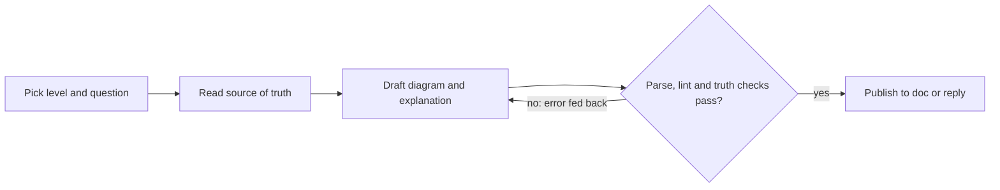

# Diagram skill suite design

## Summary

The suite makes Claude explain and diagram architectures, processes,
decisions, data and plans. Every diagram ships with a plain-English
explanation pitched to the reader's level. Diagrams are Mermaid fences in
Markdown ([ADR-0001](../adr/0001-use-mermaid-in-markdown-as-the-diagram-notation.md)).

The research
([state of the art](../reference/state-of-the-art-in-diagramming-for-agent-written-docs.md))
says syntax is the solved half: a parse-and-repair loop fixes most of it.
Truth is the unsolved half. Models invent template components and get
most arrows wrong, and no prior-art tool checks a diagram against its
source. So the design centres on two checks every skill runs before it
publishes:

1. **It parses**, against the Mermaid version GitHub renders.
2. **It is true.** Every node traces to a real record, and the prose
   says what the diagram shows.

The owner chose six focused skills (section 3,
[ADR-0002](../adr/0002-six-focused-diagram-skills-sharing-one-engine.md)).
The rest of this Spec holds for either shape.

## Requirements

- R1. Each diagram answers one question, stated in the sentence before it.
- R2. Each diagram ships with a plain-English explanation at the reader's
  level ([conventions note, section 4](../reference/conventions-adopted-from-the-sibling-repositories.md#4-how-diagrams-pair-with-the-explanation-levels)).
  The explanation doubles as the long description that WCAG 1.1.1 asks
  for.
- R3. Each diagram parses under the pinned Mermaid version, both in the
  skill's repair loop and in CI.
- R4. Each diagram carries `accTitle` and `accDescr`. Colour never carries
  meaning alone, and every encoding beyond plain boxes and arrows is in a
  legend.
- R5. Node caps per level: 7 for beginner, 12 for intermediate, 20 for
  advanced. Past the cap, split the diagram.
- R6. Every node traces to a source of truth: a repository path, a Quest
  record, a lore doc or a schema object. A node that cannot be traced is
  removed or named in the prose as an assumption.
- R7. Persisted diagrams live in lore docs and link to their Quest task or
  decision. `lore check` stays green.
- R8. The CI gate is proven both ways: it fails on a broken diagram and
  passes on the fixed one.

## Design

### 1. The loop every skill runs

What does every skill do between a request and a published diagram?



The loop starts with the reader and the question, not the picture. It
reads real records before drawing anything. The checks loop back with the
exact error until they pass, and only then does the diagram go out with
its explanation.

**Reader level.** If the active output style is `plain-english-beginner`,
`-intermediate` or `-advanced`, the skill uses that level. Otherwise it
uses intermediate, unless the user names a level.

### 2. The shared engine

All skills share one engine, kept under `skills/diagram-review/` and
reached through `${CLAUDE_SKILL_DIR}/../diagram-review/`, following
proof-skills.

| Piece | Language | What it does |
|---|---|---|
| `scripts/mermaid-check.mjs` + pinned `package.json` | Node (Mermaid's grammars exist only in JS) | Parses `.mmd` files and Markdown fences under `mermaid@11.17.2` and jsdom. Exit 0 ok, 1 syntax error, 2 environment error |
| `scripts/diagram_lint.py` | Python stdlib | Checks the profile and the rules: quoted labels, banned ids, `accTitle`/`accDescr`, node cap for the level, a legend when `classDef` is used, an explanation next to the fence |
| `scripts/diagram_truth.py` | Python stdlib | Resolves each node's `%% ref` line against its source and reports nodes that resolve nowhere |
| `scripts/quest_graph.py`, `scripts/lore_graph.py` | Python stdlib | Turn `quest … --json` and `lore graph --json` into Mermaid deterministically, so plan and decision diagrams are true by construction |
| `references/mermaid-profile.md`, `references/levels.md`, `references/accessibility.md` | Markdown | The rules, loaded on demand |

**How a node names its source.** Each node gets a Mermaid comment line,
which renderers ignore:

```text
%% ref api = path:services/api
%% ref DSKI-3 = quest:DSKI-3
%% ref notation = lore:adr/0001-use-mermaid-in-markdown-as-the-diagram-notation
%% ref orders = schema:db/migrations/001_init.sql#orders
```

`diagram_truth.py` resolves each kind. A path must exist, a Quest id must
be returned by `quest task view`, a lore id by `lore read`, and a schema
object must be found in its file. For generated plan diagrams it also
compares edges with Quest's `dependencies`.

**Where truth stops.** Whether the prose agrees with the diagram can only
be partly checked by a script: every node named in the walkthrough must
exist in the diagram, and the decision a diagram marks as chosen must
match the ADR's Decision. The rest is a judgement that diagram-review
makes against a written checklist.

### 3. Suite options

#### Option A (recommended, not chosen): lean, four skills

| Skill | Answers | Diagram types | Source of truth |
|---|---|---|---|
| `diagram` | "Explain how this works", "draw the flow", "what's the data model" | flowchart, BPMN-lite lanes, sequence, state, ER, class | Code, schema files, lore docs |
| `diagram-architecture` | "What is this system and what are its parts" | C4 context, container, component, as flowcharts with C4 classes | Repository tree, manifests, lore Reference docs |
| `diagram-plan` | "What blocks what", "where are we", "what did we decide" | Dependency DAG, milestone view, `gantt` only with real dates, decision options → outcome | `quest task/milestone/decision list --json`, `lore graph --json` (ADRs) |
| `diagram-review` | "Check these diagrams", the CI gate | All | The engine above |

`diagram` is the generalist and the default entry point. Process and data
diagrams merge into it because they share a source (code and schema) and
a reader question ("how does it work"). Decision diagrams merge into
`diagram-plan` because both read Quest records and lore's ADR graph
through the same scripts.

**Trade-off.** There are four trigger descriptions to tune and four eval
sets, so the first eval round stays small. Each skill has a distinct
source of truth, so near-miss confusion is low. The cost is that
`diagram` is broad: its SKILL.md must route between six diagram types,
and it leans on progressive disclosure through `references/`. Decision
diagrams get less dedicated guidance than a skill of their own would give.

#### Option B (chosen 2026-10-05): fuller, six skills

These are the six skills from the brief: `diagram-architecture`,
`diagram-process`, `diagram-decision`, `diagram-plan`, `diagram-data` and
`diagram-review`, with the same engine.

**Trade-off.** Each skill is narrower, so its SKILL.md is shorter and its
trigger can be sharper. The costs are six eval sets and six trigger
descriptions. Process, data and architecture compete for the same
"explain how this works" prompts. Process and data share most of their
guidance and would duplicate it or reach into each other.

### 4. Validation gate

`.github/workflows/ci.yml` runs on every pull request:

1. `npm ci` in `skills/diagram-review/scripts/`, then
   `mermaid-check.mjs` over `docs/` and every skill's `examples/`.
2. A self-test: the checker over `tests/fixtures/mermaid/fail/` with
   `--expect-fail`, and over `tests/fixtures/mermaid/pass/`. A checker
   that stops failing broken diagrams turns CI red. This proves the gate
   both ways on every run.
3. `diagram_lint.py` and `diagram_truth.py` over `docs/`.
4. `pytest` for the Python engine.
5. `lore check`.

The gate is also proven once on the pull request itself: a commit with a
deliberately broken diagram goes red, and the fix goes green.

### 5. Evaluation

The suite follows test-skills and housekeeping-skills. `evals/evals.json`
holds the cases, fixtures live under `evals/fixtures/`, and with-skill
and baseline results are committed under `evals/benchmarks/iteration-N/`.
Graders are objective where possible:

- the diagram parses;
- it stays under the level's node cap;
- `accTitle` and `accDescr` are present;
- every node exists in the fixture's source of truth;
- an explanation sits next to the diagram.

The first round is small: two cases per skill, one run per arm, so
6 × 2 × 2 = 24 runs. Its
estimated size will be put to the owner before it runs.

### 6. Repository layout

Approved by the owner on 2026-10-05, with the engine inside
`skills/diagram-review/scripts/` rather than at the repository root.

```text
diagram-skills/
├── .claude-plugin/plugin.json      nine fields, Opum AI, MIT
├── .claude/skills/<name>           symlinks to ../../skills/<name> (local dev)
├── .github/workflows/ci.yml        the gate in section 4
├── CLAUDE.md                       managed blocks only
├── LICENSE                         MIT, Opum AI
├── README.md                       sibling section order
├── docs/                           lore bundle: adr/, epics/, stories/, specs/, reference/
├── evals/                          evals.json, fixtures/, grade.py, trigger_sets/, benchmarks/
├── skills/
│   ├── diagram-architecture/       SKILL.md, references/, examples/
│   ├── diagram-process/            SKILL.md, references/, examples/
│   ├── diagram-decision/           SKILL.md, references/, examples/
│   ├── diagram-plan/               SKILL.md, references/, examples/
│   ├── diagram-data/               SKILL.md, references/, examples/
│   └── diagram-review/             SKILL.md, references/, examples/, scripts/ (the engine)
├── tests/                          pytest for the engine, fixtures/mermaid/{pass,fail}/
├── .gitignore                      node_modules/, eval workspaces, results
└── .quest/, .lore/                 tracker and lore state, committed
```

Under the rejected Option A, `skills/` would have held four
directories.

### 7. lore and Quest wiring

- One Epic for the suite and one Story per skill, plus an
  evaluation-suite Story. Each Story is linked to its Quest task with
  `lore link`.
- Each skill is one Quest task, created before its branch.
- The notation decision is ADR-0001 / DEC-1. The suite choice is
  ADR-0002 / DEC-2.

## Open questions

- Prose agreement is only partly machine-checkable (section 2). The
  first eval round will show how often the judgement half disagrees with
  a human reader.
- `C4Context` versus a flowchart with C4 classes for context views. The
  default is the flowchart, because the C4 parser accepted malformed
  input in testing. This is revisited if the evals show the flowchart
  form reads worse.
