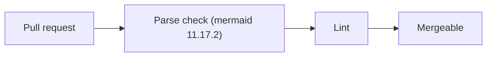

# Validation engine and CI gate

## Goal

Give every skill, and CI, one way to prove a diagram parses under the Mermaid version GitHub renders, and that it follows the profile and level rules.

## Acceptance criteria

- `mermaid-check.mjs`, pinned to mermaid 11.17.2, fails every broken fixture and passes every valid one.
- `diagram_lint.py` enforces quoted labels, banned ids, `accTitle`/`accDescr`, the level node cap and an explanation next to the fence.
- CI runs the parse check, the self-test, the lint, pytest and `lore check` on every pull request.
- The gate is shown red on a broken diagram and green after the fix, on a real pull request.

## Tasks

<!-- lore:tasks:begin -->
| Task | Title | Status |
|---|---|---|
| [DSKI-5](../../.quest/completed/DSKI-5.json) | Validation engine and CI gate for Mermaid diagrams | Done |
<!-- lore:tasks:end -->

## Notes

Part of the [diagram skill suite](../epics/diagram-skill-suite.md). Design: [suite design](../specs/diagram-skill-suite-design.md).

### Gate proof

Does the gate stop a broken diagram before it merges?

This diagram was committed broken on purpose in `ae16759`: the parse-check
label was not quoted, so its parentheses read as a shape. CI run
[37368998996](https://github.com/opum-ai/diagram-skills/actions/runs/37368998996)
failed at "Parse every Mermaid diagram" on exactly this fence. Quoting the
label fixed it, and the run on the fix commit is the green half of the proof.
