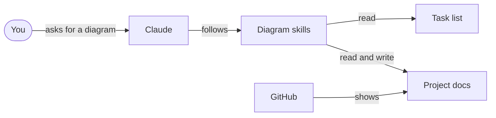
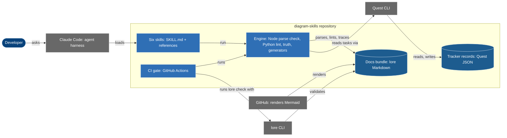

# Example: the architecture of diagram-skills, at two levels

A worked example of diagram-architecture on this repository. The same system
is drawn twice: as a context view for a beginner and as a container view for
an intermediate reader. Every box is traced to the repository with
`%% ref`, and the inventory came from `repo_inventory.py --root .`.

## Beginner: what is it for?

What does diagram-skills do, and who does it work with?

You ask Claude for a picture of your project. Claude follows the diagram
skills, which look at the project's real documents and task list instead of
guessing. The finished picture goes back into the documents, where GitHub
displays it. "Task list" is where the team records what is planned and
done.

## Intermediate: what are the parts?

What runs where, and how do the parts talk to each other?

A developer asks Claude Code for a diagram. Claude Code loads one of the six
skills, and each skill calls the same engine. The engine parses the diagram
with the Mermaid version GitHub uses, lints it, and traces every box to a
file or record. For plans it reads tasks through the Quest CLI. Every pull
request runs that engine again in CI, together with `lore check` on the docs
bundle, and GitHub renders the result. We verified each box against the
repository with `diagram_truth.py`. The Quest CLI, the lore CLI and GitHub
are tools we call, not parts we ship.

Legend: dark blue rounded box is a person; mid-blue boxes are parts this
repository ships; cylinders hold data; grey boxes are outside tools and
services. The type is also written in each label.
