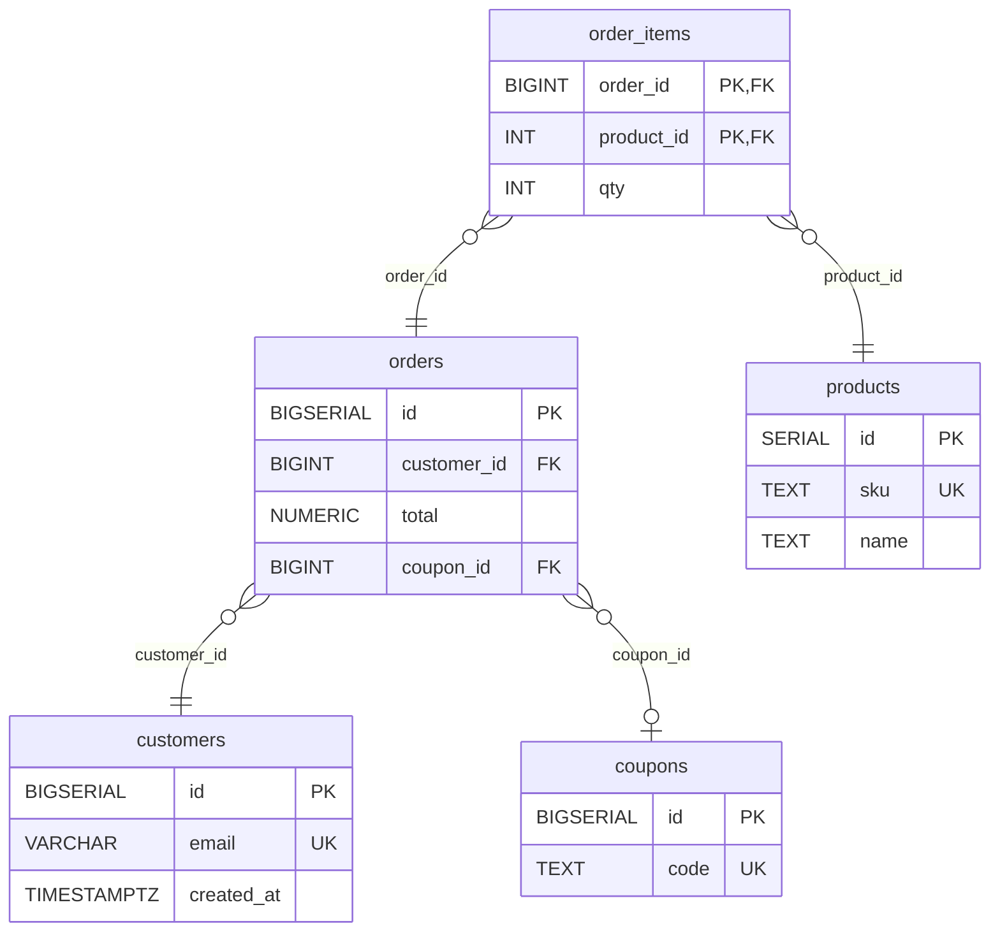
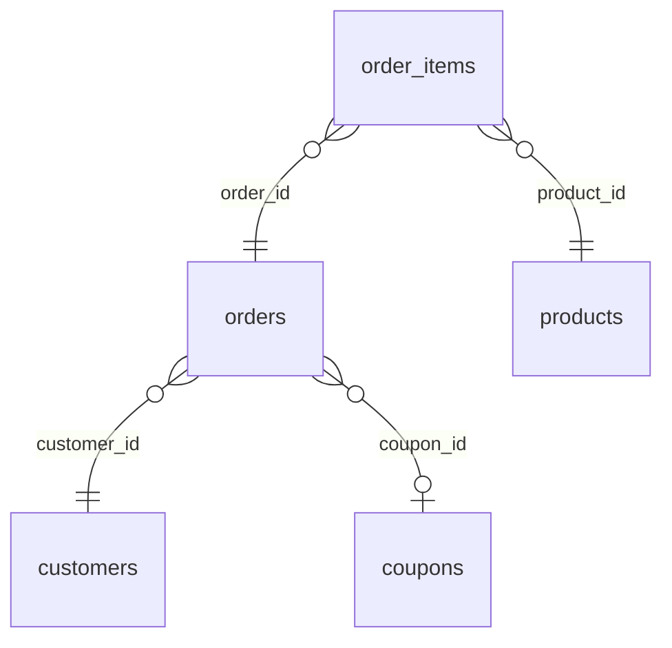

# Example: the data model of a small shop

A worked example of diagram-data. The schema is the sample migrations
directory next to this file (`shop/db/migrations/`). The diagrams were
generated with `schema_er.py`, which replays the migrations in order: the
`legacy_carts` table is created and then dropped, so it does not appear.

## Intermediate: tables, keys and how they relate

What does the shop store, and how do the tables connect?

Key: `||` exactly one, `o|` zero or one, `}o` zero or more; PK primary key, FK foreign key, UK unique.

A customer places orders, and each order holds line items that each point at
one product. An order may also carry a coupon. That link is optional,
because `coupon_id` can be empty, which is why it is drawn `o|` (zero or
one) rather than `||`. A line item is identified by its order and product
together, so the same product cannot appear twice in one order. Every
foreign key here is enforced by the database. None of these links is only
a naming convention.

## Beginner: the same data, without the columns

What kinds of things does the shop keep track of?

Key: `||` exactly one, `o|` zero or one, `}o` zero or more; PK primary key, FK foreign key, UK unique.

The shop keeps five kinds of records: customers, their orders, the items
in each order, the products for sale, and discount coupons. Each order
belongs to one customer. Each item belongs to one order and is one
product. A coupon is optional on an order.
