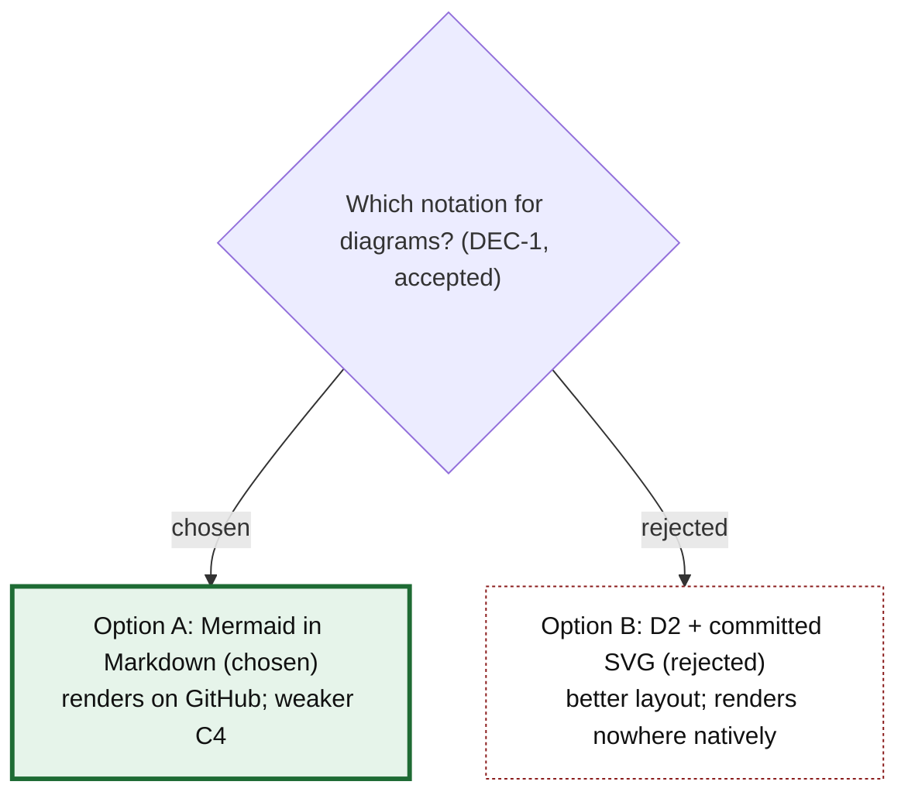
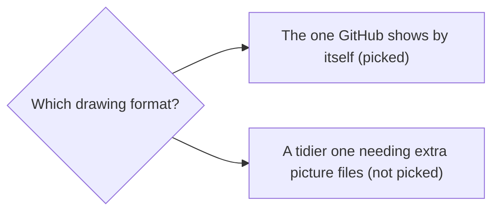

# Example: the notation decision (ADR-0001, DEC-1)

A worked example of diagram-decision on this repository's first ADR. The
options and the outcome come from
`docs/adr/0001-use-mermaid-in-markdown-as-the-diagram-notation.md` and from
`quest decision view DEC-1 --json`, which agree: Option A, accepted on
2026-10-05.

## Intermediate: the options view

Which notation did we choose for diagrams, and what did we give up?

We chose Mermaid inside Markdown because GitHub, VS Code and JetBrains show
it without any build step, and models write it fluently. The cost is
weaker C4 support and a version pin to maintain. D2 lays diagrams out
better, but nothing renders it where our docs are read. Every diagram would
become a source file plus a generated image that can drift apart. The
decision is accepted (DEC-1) and was made by the repository owner.

Legend: the thick green border marks the chosen option; the dotted red
border marks the rejected one. Each label also says "chosen" or
"rejected".

## Beginner: the same decision

What did we pick, and why?

We picked the drawing format that GitHub displays on its own. The other
format draws tidier pictures, but every picture would need a second,
generated image file kept in step with it, which is easy to forget. Showing
up correctly everywhere mattered more than tidier layout.
