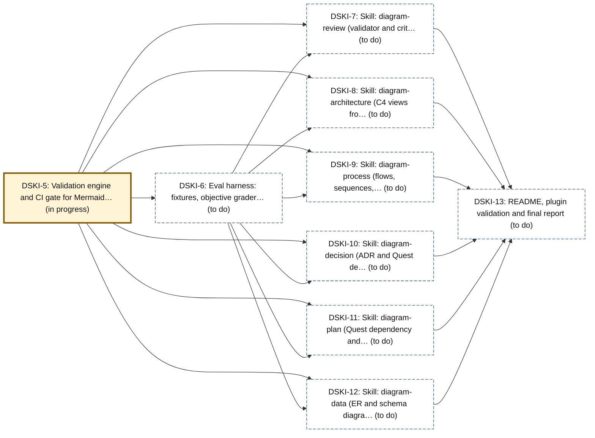

# Example: the plan for building this suite

A worked example of diagram-plan, generated from this repository's own Quest
tracker on 2026-10-05 with:

```bash
python3 skills/diagram-review/scripts/quest_graph.py deps --ids DSKI-5,DSKI-6,DSKI-7,DSKI-8,DSKI-9,DSKI-10,DSKI-11,DSKI-12,DSKI-13 --title "Building the diagram suite" --markdown
```

It is a dated snapshot: statuses move, so regenerate rather than edit. The
dependency edges are checked against Quest by `diagram_truth.py` on every CI
run.

## Intermediate: what blocks what

What has to happen before the six skills can ship?



Legend: thick border, amber: in progress; dashed border: to do. The status is also written in each box.

Everything waits on two foundations: the validation gate (DSKI-5, in
progress) and the eval harness (DSKI-6). Once both land, the six skills
(DSKI-7 to DSKI-12) can be built in any order, because none depends on
another. The README and final report (DSKI-13) close the work and wait on
all six. The critical path is therefore DSKI-5, then DSKI-6, then the
slowest skill, then DSKI-13.
