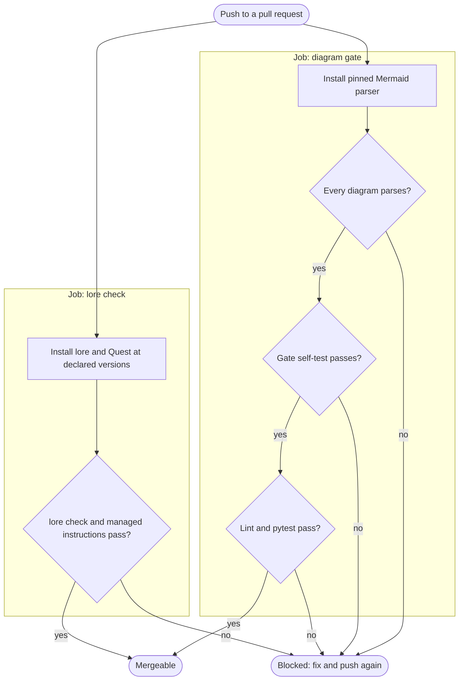
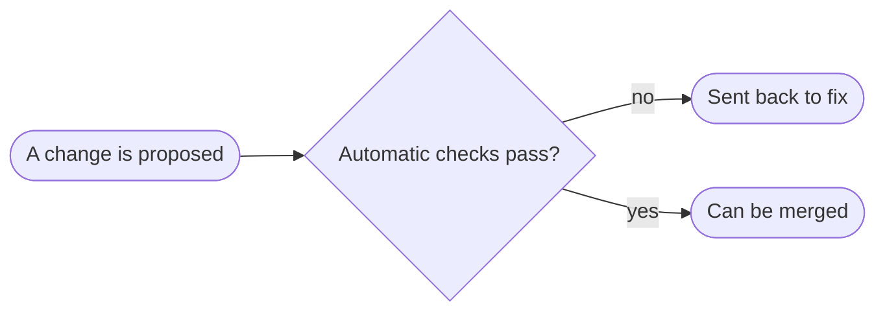

# Example: what happens when a pull request is checked

A worked example of diagram-process on this repository's own CI gate,
traced to `.github/workflows/ci.yml`. It shows a flowchart with one lane per
CI job, at intermediate level, followed by a beginner version of the same
answer.

## Intermediate: the gate, step by step

What does CI do to a pull request before it can merge?

Two jobs start together on every push. The left lane checks diagrams. It
installs the exact Mermaid version GitHub renders, parses every diagram,
then proves the checker still fails broken diagrams before trusting its
passes. Then it lints and runs the tests. The right lane checks the docs
bundle with `lore check`. Any "no" blocks the pull request; only two
"yes" paths reach merge. The self-test step is the one people skip: it is
what stops a broken checker from passing everything.

## Beginner: the same answer

Why can't a broken diagram reach the main docs?

Every proposed change is checked by a robot before anyone can merge it. If a
diagram would not display, or the documents disagree with each other, the
change goes back to its author. Only a change that passes every check can be
merged, so readers never see a broken picture.
