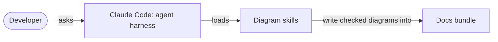

# Example: reviewing a flawed diagram

A worked example of diagram-review. The diagram below was submitted for an
architecture doc of this repository. It is shown in a `mermaid-broken`
fence so the gate does not parse it; the corrected version follows.

## The submitted diagram

```mermaid-broken
graph LR
  User --> Claude[Claude Code (agent)]
  Claude --> Skills
  Skills --> Cache[(Redis cache)]
  Skills --> Docs
```

## The review

**Verdict: redraw.** It does not parse, and one box is invented.

1. **False:** `Cache[(Redis cache)]` has no source. Nothing in the
   repository uses Redis (`repo_inventory.py` finds no datastore), so the
   box comes from a template. Remove it.
2. **Broken:** `Claude[Claude Code (agent)]` has an unquoted label with
   parentheses, so the parse check fails at line 2. Write
   `claude["Claude Code: agent harness"]`.
3. **Off-profile:** `graph` is the legacy keyword; use `flowchart LR`.
4. **Inaccessible:** there is no `accTitle` or `accDescr`.
5. **Unclear:** the edges have no verbs, and no sentence before the diagram
   says what question it answers. Nothing after it explains it.

The checks that found them:

```text
mermaid-check.mjs   FAIL ... Expecting 'SQE', ... got 'PS'
diagram_lint.py     [profile-type] [a11y-title] [a11y-descr] [quote-label]
diagram_truth.py    [untraced] Cache, Claude, Docs, Skills, User
```

## The corrected diagram

How does a request for a diagram reach the docs?



A developer asks Claude Code for a diagram, and Claude Code loads the diagram
skills. The skills check the diagram before writing it into the docs bundle.
The cache box is gone, because nothing in this repository has one; the
corrected diagram passes all three checks.
