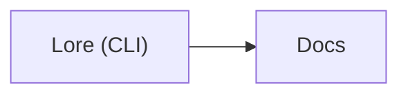

# Example doc

Good diagram:

```mermaid
flowchart LR
  A["Lore (CLI)"] --> B[Docs]
```

Some prose, then a broken one:

```mermaid
sequenceDiagram
  A B: missing arrow
```

~~~mermaid
erDiagram
  A ||--o{ B : has
~~~
