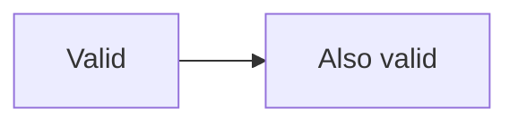

# A doc that shows a broken example inside another fence

The outer fence is an example of a whole answer, so the broken diagram
inside it is content, not a diagram the gate should parse.

~~~text
```mermaid
flowchart LR
  a[unquoted (label)] --> b
```
~~~


